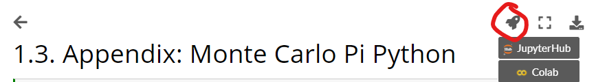

# Introduction

Molecular Dynamics and Monte Carlo
============================

In this course, we will treat computational methods that are able to describe
the properties of thermodynamic ensembles of molecules. These properties
are either determined via stochastic sampling methods (Monte Carlo
Simulations) or by following the time evolution of a molecular system for a
sufficient amount of time (Molecular Dynamics Simulations). 


The prediction of molecular properties at finite temperature - no matter
whether it be a chemical reaction in solution or in an enzyme - requires
more than the tools treated in the course 'Introduction to Electronic
Structure Methods'. Finite temperature effects can give rise to
substantial differences between an (idealised) isolated system at a
hypothetical 0 K and the physical system at $T > 0$ K. Molecules have
kinetic energy, and the system's behaviour is not governed by its
potential energy alone, but by its *free energy*, with the effects of
entropy taken into account. Consider the basic thermodynamical concept
of the free energy of a reaction, $\Delta G = \Delta H - T\Delta S$.
Although a reaction may be predicted to be endothermic based on quantum
chemical calculations at 0 K, the entropic term of the transformation
may still favour the reaction to be exergonic. The reaction will thus be
spontaneous at finite temperature (*cf.* the solvation of certain salts
in water, where the solute cools down due to a positive reaction
enthalpy, but the process is spontaneous due to a considerable rise in
entropy).

Both Molecular Dynamics (MD) and Monte Carlo (MC) simulations are
techniques that allow to obtain information about the statistical
distribution of a system, and thus on its thermodynamic properties at
finite temperature, entropic effects included. The link between the
microscopic system and the macroscopic thermodynamic observables is
established in a branch of physics known as statistical mechanics.
During the following exercise sessions, you will apply the techniques
that have been treated in the lecture to both theoretical and practical
problems; ranging from simple coding over statistical mechanics to
actually performing both MD and MC simulations. Although the scope of
this course is too small to give you a complete overview of the field,
you should be able to gain some insight into the basic methodology and
concepts.

Theses exercises are based on various textbooks and the Molecular
Simulations tutorial provided by the University of Amsterdam.


## Practical information

### Time Table Spring Semester 2026
The course will be **Tue 11h15-13h00** (Lectures in [BCH3118](https://plan.epfl.ch/?room==BCH%203118), exercises in [BCH1113](https://plan.epfl.ch/?room==BCH%201113)). 


| date            | type     | description                                               |            |
|-----------------|----------|-----------------------------------------------------------|------------|
| 17.2. Tue       |  course  | Intro & Chapter 1 (From QM to MM)                         |     UR     |
| 24.2. Tue       | exercise | Ex 1 - Monte Carlo Estimation of Pi                       | assistants |
| 03.3. Tue       |  course  | Chapter 2 (Statistical Mechanics)                         |     UR     |
| 10.3. Tue       | exercise | Ex 2 - Harmonic Oscillator                                | assistants |
| 17.3. Tue       |  course  | Chapter 3 (Monte Carlo Simulations)                       |     UR     |
| 24.3. Tue       | exercise | Ex 3 - LJ gas Monte Carlo                                 | assistants |
| 31.3. Tue       |  course  | Chapter 4 (MD Simulations 1)                              |     UR     |
| 07.4. Tue       |          | Easter Break                                              |            |
| 14.4. Tue       | exercise | Ex 4 - Molecular Dynamics                                 | assistants |
| 21.4. Tue       |  course  | Chapter 5 (MD Simulations 2)                              |     UR     |
| 28.4. Tue       | exercise | Ex 5 - Molecular Dynamics                                 | assistants |
| 05.5. Tue       |  course  | Chapter 6 (MD Simulations 3)                              |     UR     |
| 12.5. Tue       | exercise | Ex 6 - Protein folding                                    | assistants |
| 19.5. Tue       |  course  | Q&A Session                                               | assistants |
| 26.5. Tue       |   exam   | Written Exam                                              |            |

### Grading and attendance 

Please note that your attendance to the exercises is *mandatory*, during
your 1:1 interview (see below) and strongly encouraged otherwise. All the exercises can be finished
within these 2 hours, and the assistants will be with you to answer any
questions that you may have. Every set of exercises will be accompanied
by a written report.

During all except the first exercise session, each person will spend
5-10 minutes with an assistant where they will be asked questions about
the past week's exercises and the respective report, which must have
been handed in as an electronic copy at the beginning of the session (as a pdf). The
answers to these questions will be graded and, together with the written
report, contribute 1/2 to your overall grade. Please note that the last
session will be an exception, as the grading will be based on the
written report only. All reports need to be handed in one week after
the respective session except for the last record which is as noted on moodle. 

All reports are handed in via [moodle.epfl.ch](https://moodle.epfl.ch).

Since the scope of this course is limited, each exercise session is
accompanied by one or several more involved bonus questions treating
theoretical problems of relevance. Solving these bonus questions will
give you additional points at every exercise session and can thus
substantially improve your final grade of the course. 

Although the exercises include some coding, you will not be tested on your
knowledge of `Python`, but on the understanding of the general concepts
instead.

Your final grade will be based on 5 out of a total of 6 grades.

### Contents 

This list gives an overview of the topics that will be covered during
the next weeks.

-   Statistics: Numerical estimation of $\pi$ using Monte Carlo methods
-   Statistics: Statistical Mechanics and the Boltzmann Distribution
-   Monte Carlo: Detailed Balance in Monte Carlo
-   Molecular Dynamics: Implementing integrator
-   Molecular Dynamics: Solvent models and initialization
-   Molecular Dynamics: MD simulation of a biological system


### Computer environment


You can use a virtual environment in this course that you can directly launch from the exercise website. 

Simply click the rocket button on the top right of the code files and choose either `JupyterHub` to launch `noto.epfl.ch`. 


On noto.epfl.ch your work will be saved on your EPFL storage. 

To submit your code download the `.ipynb` file from noto. 

On noto you right click on the file to download.


Ask the assisstant if you have questions/problems about setting up the virtual environment. 

### Questions


We are here to help - please do not hesitate to contact us outside the
scheduled hours. You may contact us by mail, ask a question on moodle (preferred) or schedule an appointment to discuss with us in person.

If you notice any typos or mistakes in the exercise script, please
notify the assistants.

### References

Background information about the concepts of the exercise can be found in {cite}`allentildesly` and {cite}`frenkel`.


```{bibliography}
```

### License

In case you want to reuse this material.

  for **Text and Images**
 
  or  for  **Code**


